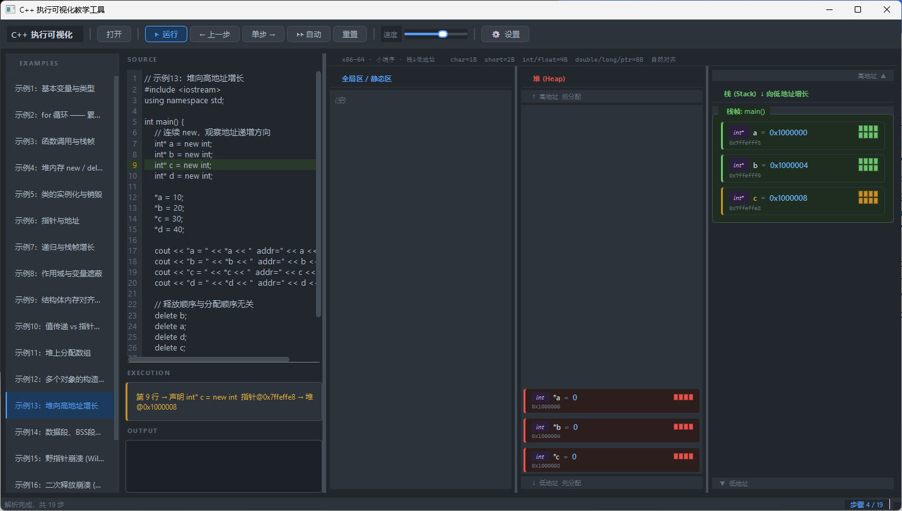

# C++ 执行可视化教学工具

**C++ Execution Visualizer — An interactive teaching tool for memory layout**

---

## 简介 / Overview

一个基于 PyQt6 的桌面应用，将 C++ 代码的逐步执行过程可视化为内存布局图。
每一步都能清晰看到栈帧的创建与销毁、堆内存的分配与释放、全局变量的存储区域，以及各类指针错误引发的崩溃现象。

A PyQt6 desktop application that visualizes the step-by-step execution of C++ code as an interactive memory layout diagram.  
Each step shows stack frame creation and teardown, heap allocation and deallocation, global variable storage regions, and crash behavior triggered by common pointer errors.

---

## 功能特性 / Features

| 功能 | Feature |
|------|---------|
| 逐步执行，单步 / 自动播放 | Step-by-step and auto-play execution |
| 栈帧层叠展示，含参数绑定 | Stacked frame display with parameter binding |
| 堆内存动态分配可视化 | Heap allocation visualization |
| 字节格子图（ByteCells） | Byte-level memory cell widget |
| 结构体内存对齐与 padding | Struct layout with padding visualization |
| 指针地址双向追踪 | Pointer-to-address cross-referencing |
| 全局 / 数据段 / BSS / 常量区 | Global / Data / BSS / Literals segments |
| 三种内存分段粒度（简单/标准/详细） | Three segmentation modes (simple/standard/detailed) |
| 分栏布局 / 统一虚拟地址空间布局 | Split-panel and unified address space layouts |
| **崩溃模拟**：野指针 / 二次释放 / 空指针解引用 | **Crash simulation**: wild ptr / double free / null deref |
| 17 个内置教学示例 | 17 built-in teaching examples |
| 可加载外部 `.cpp` 文件 | Load external `.cpp` files |

---

## 崩溃模拟 / Crash Simulation

当代码触发以下未定义行为时，工具会**暂停执行**并弹出崩溃弹框，展示崩溃原因和修复建议：

When the following undefined behaviors are triggered, the tool **halts execution** and shows a crash dialog with cause explanation and fix suggestions:

- **野指针 Wild Pointer** — `delete` an uninitialized pointer
- **二次释放 Double Free** — `delete` the same address twice
- **空指针解引用 Null Dereference** — write through a `nullptr`
- **释放后使用 Use After Free** — write through a pointer after `delete`

---

## 内置示例 / Built-in Examples

| 编号 | 示例 | Example |
|------|------|---------|
| 01 | 基本变量与类型 | Basic variables and types |
| 02 | for 循环累加求和 | For loop accumulation |
| 03 | 函数调用与栈帧 | Function calls and stack frames |
| 04 | 堆内存 new / delete | Heap allocation with new/delete |
| 05 | 类的实例化与销毁 | Class instantiation and destruction |
| 06 | 指针与地址 | Pointers and addresses |
| 07 | 递归与栈帧增长 | Recursion and stack growth |
| 08 | 作用域与变量遮蔽 | Scope and variable shadowing |
| 09 | 结构体内存对齐与 padding | Struct memory alignment and padding |
| 10 | 值传递 vs 指针传递 | Pass by value vs pass by pointer |
| 11 | 堆上分配数组 | Array allocation on the heap |
| 12 | 多个对象的构造与析构顺序 | Construction and destruction order |
| 13 | 堆向高地址增长 | Heap grows toward higher addresses |
| 14 | 数据段、BSS段与常量区 | Data segment, BSS, and literals |
| 15 | 野指针崩溃 | Wild pointer crash |
| 16 | 二次释放崩溃 | Double free crash |
| 17 | 空指针解引用崩溃 | Null pointer dereference crash |

---

## 环境要求 / Requirements

- Python 3.11+
- PyQt6 6.11+

```bash
pip install -r requirements.txt
```

---

## 运行 / Run

```bash
python run.py
```

---

## 使用方法 / Usage

1. 启动后左侧示例列表中选择一个示例，或点击「打开」加载自己的 `.cpp` 文件  
   Select an example from the left panel, or click **Open** to load your own `.cpp` file

2. 点击 **▶ 运行** 解析代码  
   Click **▶ Run** to parse the code

3. 点击 **单步 →** 逐步执行，右侧内存面板实时更新  
   Click **Step →** to advance one step; the memory panels update in real time

4. 点击 **▶▶ 自动** 开启自动播放，用速度滑块调节间隔  
   Click **▶▶ Auto** for auto-play; use the speed slider to adjust interval

5. 点击 **⚙ 设置** 切换内存分段粒度与布局模式  
   Click **⚙ Settings** to change segmentation granularity and layout mode

6. 遇到崩溃示例时，执行到问题行会自动弹出崩溃说明弹框  
   On crash examples, a dialog appears automatically at the offending line

---

## 项目结构 / Project Structure

```
C++/
├── run.py                  # 启动入口 / Entry point
├── requirements.txt
├── README.md
├── examples/               # 内置 C++ 示例 / Built-in examples
│   ├── 01_variables.cpp
│   └── ...
└── src/
    ├── main_window.py      # 主窗口 UI / Main window
    ├── cpp_interpreter.py  # 模拟执行引擎 / Execution engine
    ├── panels.py           # 内存面板组件 / Memory panel widgets
    ├── widgets.py          # 字节格子等基础组件 / Byte cell widgets
    ├── dialogs.py          # 设置弹框 / 崩溃弹框 / Dialogs
    ├── editor.py           # 代码编辑器 / Code editor
    ├── highlighter.py      # C++ 语法高亮 / Syntax highlighter
    └── config.py           # 颜色主题 / 设置 / Theme and settings
```

---

## 内存分段粒度 / Segmentation Modes

| 模式 | 分区 | Mode | Segments |
|------|------|------|----------|
| 简单 | 代码区 / 全局 / 堆 / 栈 | Simple | Code / Global / Heap / Stack |
| 标准 | 全局区 / 堆 / 栈 | Standard | Global / Heap / Stack |
| 详细 | Code / Literals / Data / BSS / Heap / Stack | Detailed | Code / Literals / Data / BSS / Heap / Stack |

详细模式采用 **2 行 × 3 列** 布局，上行为只读区（代码/常量/数据段），下行为运行时区（BSS/堆/栈）。

In detailed mode, the layout is **2 rows × 3 columns**: the top row shows read-only regions (Code / Literals / Data), and the bottom row shows runtime regions (BSS / Heap / Stack).

---

## 支持的 C++ 子集 / Supported C++ Subset

| 特性 | 支持 | Feature | Supported |
|------|------|---------|-----------|
| 基本类型 int/float/double/char/bool | ✓ | Basic types | ✓ |
| 指针类型 int* / float* | ✓ | Pointer types | ✓ |
| 变量赋值、复合赋值 +=/-=/*= | ✓ | Assignment and compound assignment | ✓ |
| 自增/自减 ++/-- | ✓ | Increment/decrement | ✓ |
| for / while 循环 | ✓ | Loops | ✓ |
| if / else | ✓ | Conditionals | ✓ |
| 函数定义与调用 | ✓ | Function definition and calls | ✓ |
| 递归（有限深度） | ✓ | Recursion (bounded depth) | ✓ |
| new / delete / delete[] | ✓ | Dynamic memory | ✓ |
| class / struct，含构造/析构 | ✓ | Classes with ctor/dtor | ✓ |
| cout 输出 | ✓ | cout output | ✓ |
| 全局变量 / 静态变量 | ✓ | Global variables | ✓ |
| 崩溃/UB 检测 | ✓ | Crash / UB detection | ✓ |

---

## 地址模型 / Address Model

模拟 x86-64 小端序，地址为教学演示用虚构值：

Simulates x86-64 little-endian; addresses are illustrative, not real:

| 区域 | 基址 | Region | Base |
|------|------|--------|------|
| 代码段 | `0x00401000` ↑ | Code | `0x00401000` ↑ |
| 常量区 | `0x00402000` ↑ | Literals | `0x00402000` ↑ |
| 全局/数据段 | `0x00400000` ↑ | Global / Data | `0x00400000` ↑ |
| 堆 | `0x01000000` ↑ | Heap | `0x01000000` ↑ |
| 栈 | `0x7FFF0000` ↓ | Stack | `0x7FFF0000` ↓ |

---

## 图片展示 / Screenshots


